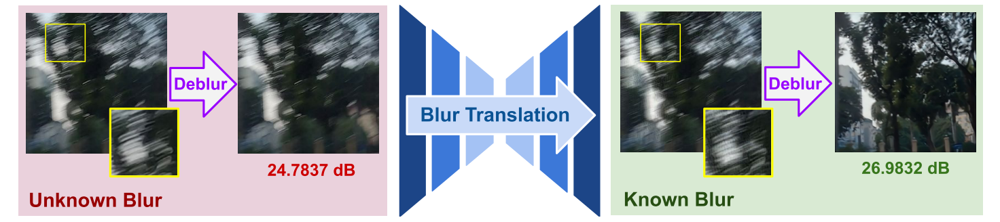
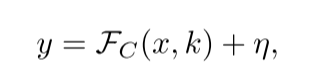
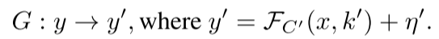
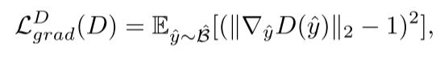
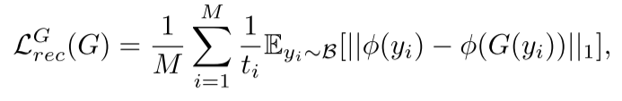

  # Blur2Blur：任意未知PSF函数转已知--效果炸裂

### 

先说一下缺点：数据处理描述的比较模糊，我感觉是这样，里面明明用了很多imgaug这样的技术，却并没有做一个很明确的数据；流程排版，比如清晰-模糊对数据怎么生成的，包括官网也只是简单的给了一个数据下载链接，就没了。

另一个很重要的缺点就是有一个issue指出：复现后达不到论文中的精度，要求提供预训练权重。结果过去了这么久，权重还是没放出来。

### 背景和挑战

以往的deblur方法依赖于预训练模型、或者<u>配对的图像数据</u>、模拟的合成数据、或者简单的假设模糊核是已知的。

> 这里用各种story包装强调了一下模糊域不同很麻烦、图像配对很麻烦，突出了一下本文方法的好

因此以前的方法存在一个挑战，同时也是本文要解决的目标：

如何在模糊空间未知，且没有模糊和清晰图像的配对数据的情况下，完成deblur？

### 本文方法

**y是模糊图像，x是清晰图像**，**C是未知模糊域**(跟设备参数、环境好坏这些有关系)，k是模糊核，η 是噪声项。一般来说deblur的目标是找到一个$$\mathrm{G}_C^*$$，使得$$G_C^*\left( y \right) = x$$。也就是我们必须摸清楚这个模糊域是啥。

首先那些预训练模型有我们**已知的模糊域\(G_{C'}^***\)，但是这个C'肯定不能直接用在我们的数据上，因为模糊域不同。于是就又提出了一个翻译函数（translation function）G，我们通过不断学习更新这个G，使得$$\mathrm{G}_C^* = G_{C'}^* \circ  G$$。

> 看到这里感觉不太对劲啊，查了一下圆圈代表复合函数的操作，也就是先对y用G，然后再用$$G_{C'}^*$$？这里应该是写反了吧。

也就是：

到这里可以看出，本文的方法其实是把一个deblur任务分成两步走，一步是学习从未知模糊域C到已知模糊域C'的转换函数G，一步是用一个已知模糊域上的预训练模型进行deblur。

> 这样还有个好处就是已知域你甚至可以利用自己做的合成数据，比如一个清晰图你拿高斯模糊一下，再训一个模型出来就能用到这个方法里面

#### 第一步：Blur2Blur

数据集：

- B，由来自未知模糊域的模糊图像组成；
- K 包含具有已知模糊的图像，并且已经为其训练了去模糊模型。

损失函数：

- Adversarial Loss:上面提到的转换函数G其实实现方式就是个生成器，然后这里又引入了一个判别器D，一个典型GAN网络。G输入未知模糊域图像，输出已知域图像。D来判断是不是真的已知域。

> 这里也没有把模糊域单独剥离出来，就是喂给判别器俩个图，让判别器输出假图的可信度。只是在文字里包装成了“判别是否属于已知模糊域”。

- 一个梯度惩罚损失函数：（乱七八糟搞来搞去还不是一个GAN，这里作者说是什么Lipschitz连续性约束）

​									

> 这里我完了看看代码是个怎么事儿

- 一个重建损失函数：用了一个感知损失(pretrained VGG19)来最小化生成器输入输出，保留图像的视觉一致性，但改变模糊域。

> 提到一个多重损失函数 尺度去模糊架构，需要看看代码

​							

看完之后有点感慨，就这么一个普普通通毫无亮点的GAN就能发cvpr，唉

