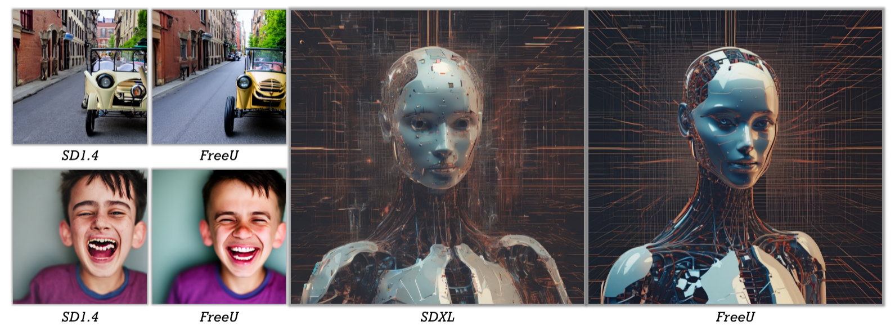
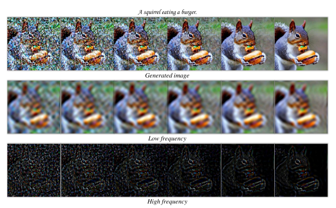
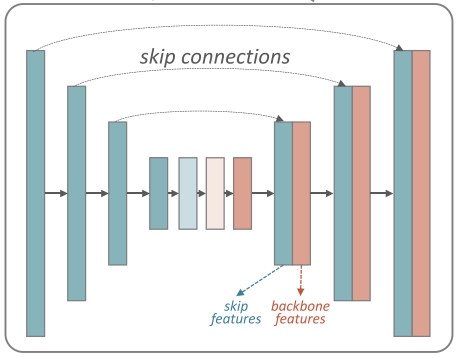
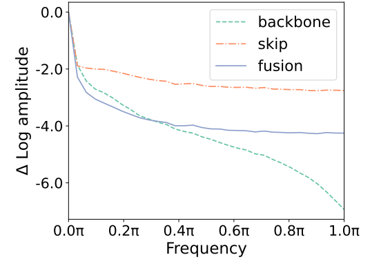
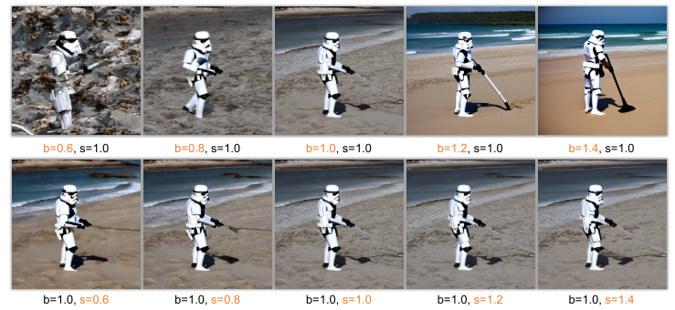
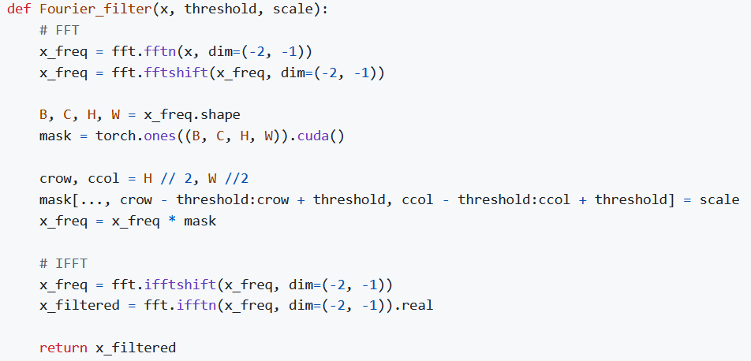

# FreeU：无训练、无额外参数、无内存增加、无采样时间消耗

	

优点：直接看图和标题就完事了，效果强大。就几行代码，超级简单，拿了oral，而且github 1.7K Star。

缺点：美中不足的是，他们的评估方法是找了35个人，让这些人投票说哪个方法更好...(但是确实结果很容易区分)

#### 动机概述

他们在使用扩散模型(UNet这种)的时候，发现了一个很糟糕的现象就是生成出来的图有些细节很明显AI化，比如五根手指、牙齿不在牙龈上这些。

纳闷的同时，对扩散的中间图做了个高低频分离，结果如下所示：

从这个图，就可以得出一个很明显的结论，在扩散过程中，我们的视觉感知中，低频部分从始至终好像都没怎么变，就算加了很多噪声，低频还是能肉眼可见的当做我们认知中的清晰图（也就是低频保留了有价值的全局结构信息和一些重要语义等等）

但是高频部分呢？很明显是随着噪声的波动而波动的。

也就是说，我们扩散的加噪、去噪过程，大部分是加在了高频上。

有没有可能扩散模型效果不好就是因为这个实验呢？

------

我们先把这个问题保留，思考一下在UNet中，高低频是如何体现的？

其实很好想，低频主要是由网络主干，就是那些解码器的卷积块输出的高级语义带来的。高频主要是由残差连接（UNet这个特有的结构）带来的。当然我们不能只靠自己主观猜测，要做实验来论证。

很明显可以看到主干特征图在做傅里叶变换后，高频部分是被极大抑制的，而残差连接的那些特征恰恰相反。

所以有没有可能我们设置一下 主干输出的特征，和残差连接的特征，的各自的占比，就能让扩散模型效果变好呢？（注意我们现在说的是一个训练好的扩散模型UNet）

那么就再做一个实验：

b是用来调节主干输出的特征占比，s是残差的特征占比。可以看到s不变，b变，影响真的很大，而且效果也是很明显的变好。但是s的改变带来的影响很弱。（文中也有用幅频图来证明）

> 其实到这里我感觉就结束了，就这么一个小实验，说明调节主干特征图能让效果变好，就完事了，就能发CVPR。至于后续对s加傅里叶变换来采样，我感觉都是为了增加contribution硬加的。

这是为什么？就引出了本文的方法。

#### 方法概述

其实就是一个b和s的实现概述。

b是通过对特征图进行通道平均，将平均结果归一化之后，用超参数b来控制每一个特征值的大小。最后将这个结果和输入的特征图进行逐元素相乘。

这里有个问题就是，我们肯定不能对每个通道做这个乘法，因为所有值都一样了，那效果肯定不好，要留一些原来的信息。（用作者的话解释就是对全部的通道做乘法会导致过平滑，从而牺牲了图像的高频信息）

s是通过将特征变换到傅里叶空间，在傅里叶空间对频域应用了超参数s，然后再逆变换到原空间。

最后和原本的UNet操作一致，将主干特征和残差特征拼接，继续做前向传播。

