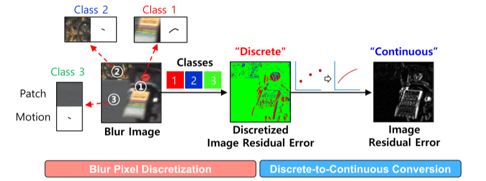
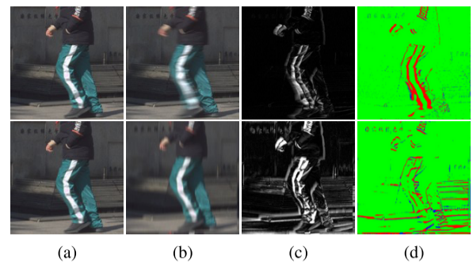
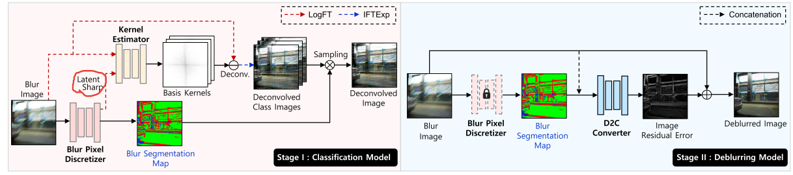
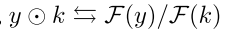

# SegDeblur:从图像残差的角度出发

**图像残差，即模糊-锐利像素差异**，可以根据其运动模糊类型及其相邻像素的复杂程度分为几类。 受此启发，将去模糊（回归）任务分解为模糊像素离散化（像素级模糊分类）和离散到连续转换（模糊类图回归）任务。 

优点：计算效率比基线方法提高了10%多，而且已商用到google和三星等公司。

缺点：没代码，不知道是不是商用的原因。很多细节没公开。

#### 动机概述

我们都知道连续回归任务先做离散分类再映射到连续空间会简化任务。但是怎么把这个思想包装成论文的story呢？

首先简要介绍运动模糊是什么，为什么，怎么做(以前的工作)。然后给一个图：

说如图 2(c) 上侧所示，与非移动区域相比，对象移动区域（例如腿）突出了图像残差，即模糊锐利像素差异。 相反，如图2（c）下侧所示，尽管所有像素的模糊程度相同（即均匀模糊），但高频区域（例如边缘）显示出明显的图像残留误差，而不是高频区域（例如边缘）。 即，图像残差由其运动类型（例如，运动量和方向）和空间频率（例如，相邻像素的复杂度）来表征。 使用这种运动频率特性，图像残留误差可以分为一些类别，例如低水平或高水平。

> 虽然是讲故事，但是自然而然的为下文方法中的傅里叶变换做了铺垫。我咋越看越牵强呢

最后自然而然的引出本文的解决方案。

#### 方法概述

因为有些细节没有公开，这里我就简单概述一下pipeline，对于具体的我也不清楚，没代码的话我看起来比较吃力。

首先我们有一对图像（清晰和模糊），

##### 第一阶段

模糊图先经过一个Blur Pixel Discretizer输出一个分割图，这个分割图中的像素值是{0，1,2,3,4...R}（作者这里说分了R个类别，做消融后，在RealBlur数据集上R=16，其他数据集上R=8）。Blur Pixel Discretizer作者选用NAFNet.该模型中间有一个latent，作者会把latent单独拿出来和清晰图做PSNRloss，这样就得到了一个latent sharp。（这里我也不知道具体咋实现的，按理说latent和清晰图的尺寸压根不匹配，怎么能做loss呢）

> 看了一下NAFNet的源码知道了，就是个纯卷积网络，不涉及transformer那套folder操作，所以latent就是原图下采样后的尺寸。这里盲猜要做loss肯定要把latent上采样回去

与此同时模糊图还会经过一个傅里叶变换+对数变换，变换后的结果和latent sharp合并，一起喂给Kernel Estimator，注意latent sharp也要经过傅里叶+对数变换。然后Kernel Estimator会输出一组长度为R的核，用这些核对输入的模糊图做解卷积操作（注意模糊图要经过傅里叶对数变换），再把解卷积的结果用逆对数变换(也就是指数变换)+傅里叶逆变换给换到正常的原来的域。这样我们就得到了一组数量为R的解卷积图，为什么是R个？因为我们有一个采样过程，也就是在这些图的通道维度，选择像素索引对应另一个分支输出的分割图的值。经过这个采样，得到一张解卷积图，再用这个解卷积图和清晰图做PSNRloss。

> 至于为什么要做傅里叶变换，是因为，为什么要取对数，那当然是简化计算了，直接让这里除法变成减法。可能是因为在傅里叶空间做核估计比较方便吧，但是具体的细节，比如要不要移动零频率分量、逆变换过程产生的虚部如何处理。这些都没说。
>
> 这个核估计，因为没公布实现细节。所以我盲猜在代码里实际没有这一步，直接端到端在UNet里面实现了。到时候可以再检查一遍论文看看有没有细节。
>
> 这样两分支还有一个好处就是，不需要为分割图指定gt，而是间接通过指导采样的方式实现学习优化。

##### 第二阶段

这个就更简单了，我们第一阶段输出的分割图和原始输入拼接后，一起喂给D2C Converter(这里也是用的NAFNet)。输出的结果要和原始输入相加，最后和清晰图做PSNRloss。这样不断训练，D2C其实输出的就是模糊图和清晰图之间的残差。

